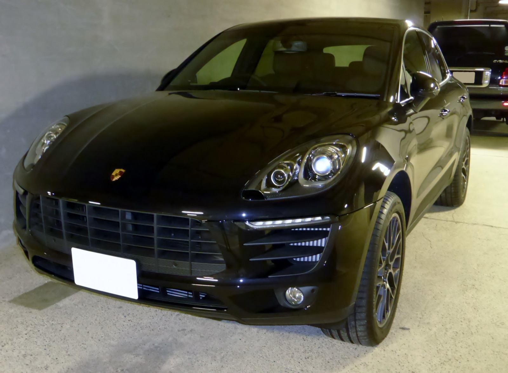
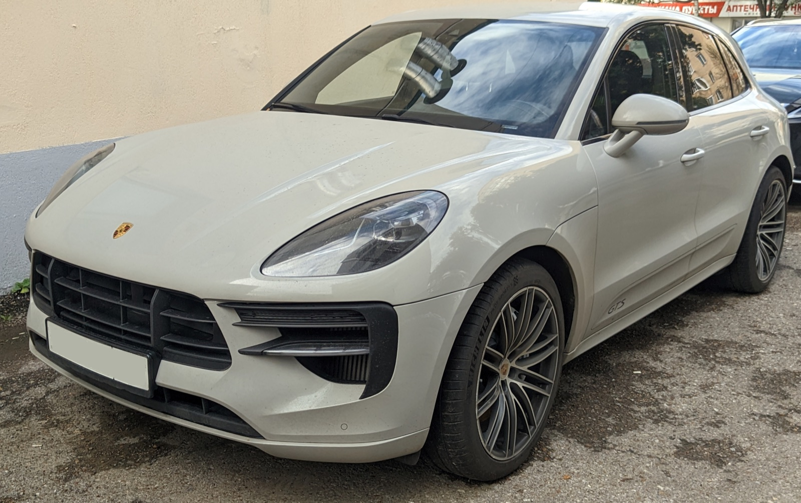

# Porsche Macan 95B.1–95B.2 — универсальная шпаргалка

**Версия:** 1.0  
**Срез рынка РФ:** 13 сентября 2026

> **Охват:** только Porsche Macan первого поколения 95B: дорестайлинг **2014–2018** и первый рестайлинг **2018–2021**, прежде всего в конфигурациях, реально встречающихся на рынке РФ.
>
> **Не входит:** рестайлинг 2021+ и электрический Macan.
>
> **Цель:** по одному документу понять шильдик, двигатель, мощность, коробку, склонность к задирам, типовые проблемы, стоимость крупных ремонтов, регламент обслуживания, жидкости, топливо, PPI и адекватную цену покупки на вторичном рынке РФ.
>
> **Важно:** конкретный код двигателя/PDK, допуск жидкости и заправочный объём могут зависеть от VIN, рынка и модельного года. Перед покупкой расходников финально сверять VIN/PET/PIWIS/мануал.

---

## Оглавление

- [Какой Macan покупать — короткий ответ](#which-one)
- [Macan 95B.1 — 2014–2018](#macan-95b1)
- [Рынок РФ: 95B.1](#market-95b1)
- [Macan 95B.2 — 2018–2021](#macan-95b2)
- [Рынок РФ: 95B.2](#market-95b2)
- [PDK, PTM и полный привод](#transmissions)
- [Регламент обслуживания](#maintenance)
- [Масла ДВС: допуски, вязкости и объёмы](#engine-oil)
- [Остальные жидкости](#fluids)
- [Топливо](#fuel)
- [PPI перед покупкой](#ppi)
- [Короткий полевой PPI](#field-ppi)
- [Шкала стоимости ремонтов](#repair-costs)
- [Короткая карта всей линейки](#quick-map)
- [Источники и подход к данным](#sources)
- [REFERENCES.md](REFERENCES.md)
- [CHANGELOG.md](CHANGELOG.md)
- [TL;DR](#tldr)

---

# Какой Macan покупать — короткий ответ

| Поколение | Самый рациональный | Самый сбалансированный | Самый интересный | Самый опасный без хорошего PPI |
|---|---|---|---|---|
| **95B.1** | **2.0 252**; Diesel 245 при осознанном выборе дизеля | **S 340**, но только после эндоскопии | **GTS 360** | **Turbo / Turbo Performance без эндоскопии и резерва** |
| **95B.2** | **2.0 252** | **S 354** | **GTS 380** | **Turbo 440**, если покупается по нижней границе бюджета |

Ключевая мысль всего гайда:

> **Macan 95B.1 и 95B.2 похожи кузовом, но V6 у них принципиально разные.** Дорестайлинговые Porsche V6 3.0/3.6 имеют реальный риск bore scoring и требуют эндоскопии. Рестайлинговые Audi-family EA839 3.0/2.9 используют другую архитектуру с чугунными гильзами; переносить на них диагноз «классический Alusil-задир» неправильно.

### Легенда ремонтопригодности

- 🟢 — агрегат хорошо изучен, запчасти и компетенции широко доступны;
- 🟡 — ремонтируется нормально, но дорого и/или требует профильного сервиса;
- 🟠 — специализированный ремонт, дорогие узлы или ограниченные компетенции;
- 🔴 — крайне тяжёлый или экономически сомнительный ремонт.

`Ремонтопригодность` — это не то же самое, что финансовый риск `💸`: технически ремонтируемый агрегат может быть очень дорогим.

---

# Porsche Macan 95B.1 — 2014–2018

  

Фото: <a href="https://commons.wikimedia.org/wiki/File:The_frontview_of_Porsche_Macan_S.JPG">Tokumeigakarinoaoshima / Wikimedia Commons</a> — CC0 1.0.

| Название | Мотор | Код мотора / семейство | Мощность РФ | Привод | Коробка | Задиры | 💸 |
|---|---|---|---:|---|---|---|---|
| **Macan** | **2.0 R4 бензин, turbo** | **CYP / EA888** | **252 л.с.** | AWD | 7PDK | 🟢 Классические Alusil-задиры не характерны | 🟢/🟡 |
| **Macan S** | **3.0 V6 бензин, biturbo** | **MCT.MA / CTM** | **340 л.с.** | AWD | 7PDK | 🟠 **Реальный риск** | 🟠 |
| **Macan GTS** | **3.0 V6 бензин, biturbo** | **DCN / Porsche 3.0 V6 family** | **360 л.с.** | AWD | 7PDK | 🟠 **Реальный риск** | 🟠 |
| **Macan S Diesel** | **3.0 V6 дизель, turbo** | **MCT.BA / CTB / EA897 family** | **245 л.с.** | AWD | 7PDK | 🟢 Не типовая проблема | 🟡 |
| **Macan Turbo** | **3.6 V6 бензин, biturbo** | **MCT.LA / CTL** | **400 л.с.** | AWD | 7PDK | 🟠 **Реальный риск** | 🔴 |
| **Macan Turbo Performance** | **3.6 V6 бензин, biturbo** | **DHK / 3.6 V6 family** | **440 л.с.** | AWD | 7PDK | 🟠 **Реальный риск** | 🔴 |

> Коды `CYP/CTM/DCN/CTL/DHK` часто встречаются как VAG/рынковые engine codes; Porsche-обозначения вроде `MCT.MA/MCT.LA` зависят от рынка. На конкретной машине финально проверять VIN/наклейку агрегатов/PIWIS.
>
> **Важно про 2.0 дорест:** в российском каталоге 252-сильный Macan 2.0 появляется с **04.2016**. На вторичке РФ встречаются и более ранние импортные 2.0 — прежде всего японские **237 л.с., код CNC, 2014–09.2016**. Это та же общая линия EA888 по характеру обслуживания, но такие машины нельзя автоматически смешивать с российским `CYP 252` при сравнении года, происхождения и цены.

## Что здесь происходит

### 2.0 turbo 252 — EA888

Самый рациональный бензиновый Macan дорестайла.

Это не уменьшенный Porsche V6, а VAG EA888 с чугунным блоком. Поэтому главный страх 3.0/3.6 — классический bore scoring алюминиевых цилиндров — сюда напрямую не переносится.

Типовые вопросы:

- помпа/термостат;
- PCV;
- нагар на впуске;
- катушки/свечи;
- турбина/wastegate на большом пробеге;
- цепь и фазы на больших пробегах;
- отдельные случаи повышенного расхода масла.

Главный минус — не надёжность, а характер: это хороший быстрый кроссовер, но из всей линейки он меньше всего даёт ощущение «моторной Porsche-экзотики».

**Итог:** лучший выбор, если нужен именно Macan и хочется минимизировать моторный риск.

### S 3.0 biturbo 340

Один из самых массовых и одновременно самых важных для диагностики Macan.

Основные вещи:

- **bore scoring**;
- алюминиевые болты передней крышки ГРМ и масляные течи;
- помпа/термостат;
- PCV;
- нагар;
- масляные магистрали турбин;
- катушки/свечи;
- возрастные турбины.

Для этого двигателя формула простая:

> **нет эндоскопии — нет покупки.**

Низкий пробег сам по себе ничего не гарантирует: есть документированные случаи серьёзного scoring и на относительно небольших пробегах.

### GTS 3.0 biturbo 360

По фундаменту близок к S, но мощнее, острее настроен и обычно лучше укомплектован по шасси.

Риски цилиндров и передней крышки ГРМ **никуда не исчезают**. Покупать GTS только потому, что «GTS обычно любили и обслуживали» — плохая логика. Эндоскопия обязательна ровно так же.

Зато исправный GTS — одна из самых удачных версий первого Macan с точки зрения баланса мощности, шасси и повседневности.

### S Diesel 3.0 245

Российская версия 3.0 TDI была дефорсирована относительно распространённой европейской 258-сильной.

Профиль риска типично VAG-дизельный:

- EGR;
- DPF;
- вихревые заслонки/впуск;
- термостат и охлаждение;
- форсунки и топливная высокого давления;
- турбина;
- цепи на больших пробегах;
- возрастные утечки масла/ОЖ.

Зато нет главной моторной страшилки дорестайловых бензиновых V6 — классического Alusil bore scoring.

**Итог:** очень рациональный Macan при больших трассовых пробегах и живой экологии. Для коротких городских поездок с постоянно недогретым DPF — уже не такой очевидный выбор.

### Turbo / Turbo Performance 3.6

**Turbo = 400 л.с.**  
**Turbo Performance = 440 л.с.**

Это развитие той же ранней Porsche V6-архитектуры: цилиндры требуют эндоскопии, а поверх этого получаем более высокую тепловую нагрузку и более дорогие турбины/охлаждение/тормоза.

Исправный Turbo действительно очень быстрый. Но его текущая цена на вторичке ничего не говорит о стоимости содержания: ремонт остаётся ремонтом бывшего очень дорогого Porsche.

## Что реально приезжает, когда и сколько готовить

### 2.0 CYP / EA888

**80–150 тыс. км:** помпа/термостат, PCV, катушки, свечи, нагар, мелкие утечки.

**150–220+ тыс. км:** цепь/фазы, турбина/wastegate, более крупные масляные и охлаждающие работы.

**Ориентир по РФ, независимый профильный сервис, 2026:**

- PCV/катушки/датчики/мелкие течи: **15–50 тыс. ₽**;
- чистка впуска: **30–60 тыс. ₽**;
- помпа/термостат: **40–90 тыс. ₽**;
- цепи/фазы: **120–250 тыс. ₽**;
- турбина/крупная работа: **100–200+ тыс. ₽**.

**Ремонтопригодность: 🟢/🟡.** Хорошая база VAG-компетенций и запчастей.

### S / GTS 3.0 V6

У bore scoring **нет честного пробега, после которого он “начинается”**. Состояние цилиндров определяется эндоскопом, а не цифрой на одометре.

**80–150 тыс. км:** охлаждение, PCV, нагар, катушки/свечи, масляные течи, магистрали турбин.

**100–180+ тыс. км:** турбосистема, цепи/фазы и накопленные возрастные проблемы становятся всё актуальнее.

**Деньги:**

- локальная замена проблемных болтов/небольшая течь крышки: **30–80 тыс. ₽**;
- полный качественный reseal передней крышки с большим разбором: **150–300 тыс. ₽**;
- помпа/термостат/охлаждение: **40–100 тыс. ₽**;
- турбины/магистрали: **150–300+ тыс. ₽**;
- большой ГРМ/фазы: **180–350 тыс. ₽**;
- ремонт цилиндров/капиталка: **≈600 тыс.–1 млн+ ₽**.

**Ремонтопригодность: 🟡.** Ремонтировать умеют, но здоровый мотор при покупке сильно дешевле спасения задранного.

### S Diesel 3.0

**80–150 тыс. км:** EGR, впуск, термостат, датчики, локальные течи.

**150–250+ тыс. км:** DPF по золе, турбина, форсунки/ТНВД, цепи становятся всё более актуальны.

**Деньги:**

- EGR/впуск/датчики: **30–100 тыс. ₽**;
- DPF/турбина: **70–180 тыс. ₽**;
- топливная/форсунки: **100–250 тыс. ₽**;
- большой цепной ремонт: **180–350 тыс. ₽**.

**Ремонтопригодность: 🟢/🟡.** Очень много VAG-дизельных компетенций, но крупная топливная работа дешёвой не бывает.

### Turbo / Turbo Performance 3.6

Всё, что относится к 3.0 V6, остаётся актуальным, но тепловая и финансовая нагрузка выше.

**Ориентир:**

- течи/охлаждение/PCV: **50–150 тыс. ₽**;
- крупная турбо-работа: **180–400 тыс. ₽**;
- цилиндры/капиталка: **≈650 тыс.–1 млн+ ₽**;
- двигатель + турбины + ГБЦ + сопутствующее: **1 млн ₽+** вполне реальный сценарий.

**Ремонтопригодность: 🟡.** Технически понятный Porsche, финансово — уже взрослый проект.

## Общие болезни 95B.1

### Раздатка / PTM — один из главных пунктов

Для MY2014–2018 проблема долговечности transfer case была настолько заметной, что на части зарубежных рынков Porsche продлевала гарантию именно на этот узел до 7 лет без ограничения пробега. **Это не означает бесплатную гарантию в РФ сегодня**, но хорошо показывает масштаб известности проблемы.

Симптомы:

- дрожь/shudder на лёгком газу;
- рывки при разгоне;
- ощущение «едем по стиральной доске»;
- подёргивания на малой скорости;
- иногда сильнее после прогрева.

На ранней стадии свежая правильная жидкость иногда существенно улучшает ситуацию; механически убитый узел этим не лечится.

Практический бюджет: **≈80–180 тыс. ₽** в зависимости от ремонта/замены и используемых деталей.

### Течь передней крышки ГРМ

На ранних V6 известны алюминиевые болты крышки, которые могут ослабевать/ломаться. Масло течёт вниз и легко создаёт впечатление совершенно другого источника.

Есть два разных сценария:

- локальный ремонт проблемных верхних болтов;
- полноценное снятие/перегерметизация крышки с заменой крепежа.

Не надо автоматически соглашаться на «двигатель умер» по одному мокрому поддону — сначала найти **реальный источник**.

### PDK

Сама коробка в целом крепкая, но возможны:

- мехатроник;
- соленоиды;
- сцепления;
- датчики;
- утечки;
- адаптации;
- последствия неправильного уровня/жидкости.

Ориентир по крупному ремонту: **≈150–250 тыс. ₽+**, мехатроник часто **≈80–130 тыс. ₽**.

### Подвеска

Обычная пружинная подвеска проще. Пневма — комфортнее и универсальнее, но добавляет:

- компрессор;
- клапанный блок;
- пневмостойки;
- датчики уровня.

Это не катастрофа: всё давно диагностируется и ремонтируется.

### Панорама и вода

Проверять дренажи, потолок, стойки, ковры и электрические разъёмы. Вода в современном Porsche иногда обходится дороже механической детали.

### Рычаги / опоры / ступичные

Macan тяжёлый и мощный. Верхние рычаги, сайлентблоки, опоры двигателя и ступичные — обычная возрастная расходная история.

## Рейтинг 95B.1

**2.0 252 → самый рациональный бензин.**

**Diesel 245 → очень рационален при правильном режиме эксплуатации.**

**S 340 → отличный баланс, но эндоскоп обязателен.**

**GTS 360 → самый интересный дорестайл для водителя.**

**Turbo 400 → серьёзная машина с серьёзным резервом.**

**Turbo Performance 440 → редкая дорогая игрушка; состояние важнее скидки.**

---

# Рынок РФ — Macan 95B.1, сентябрь 2026

## Как читать цены

Это **зоны цен предложения**, а не гарантированные цены сделки. Основа — Auto.ru, Avito и Drom с очисткой дублей, проектов, машин не на ходу и условных «цен при кредите/трейд-ин». Если реальная наличная цена понятна, используется она.

Drom на момент среза показывает более 400 Macan всех лет по РФ; по отдельным ранним годам — десятки предложений. Для Turbo Performance выборка маленькая, поэтому границы менее устойчивы.

| Версия | 🔴 Подозрительно дёшево | 🟠 Низ рынка | 🟢 Нормальный рынок | 🔵 Хороший экземпляр | 🟣 Верх рынка | Устойчивость |
|---|---:|---:|---:|---:|---:|---|
| **2.0 252 (РФ)** | **<2.5 млн** | **2.5–3.0** | **3.0–3.8** | **3.8–4.5** | **>4.5** | высокая |
> Ранние импортные `2.0 237 CNC` в эту строку **не смешиваются автоматически**: происхождение, правый/левый руль, история ввоза и спецификация конкретной машины заметно влияют на цену.
| **S 3.0 340** | **<2.0 млн** | **2.0–2.4** | **2.4–3.3** | **3.3–4.0** | **>4.0** | высокая |
| **GTS 3.0 360** | **<2.8 млн** | **2.8–3.2** | **3.2–4.2** | **4.2–5.0** | **>5.0** | средняя |
| **S Diesel 3.0 245** | **<2.8 млн** | **2.8–3.4** | **3.4–4.3** | **4.3–5.0** | **>5.0** | средняя |
| **Turbo 3.6 400** | **<2.5 млн** | **2.5–3.0** | **3.0–4.1** | **4.1–5.0** | **>5.0** | средняя |
| **Turbo Performance 440** | **<3.2 млн** | **3.2–3.8** | **3.8–5.0** | **5.0–6.0** | **>6.0** | низкая |

### Что означают эти зоны

**Красная зона** — не «выгодная покупка», а повод понять, чего не хватает в объявлении: история, двигатель, кузов, пробег, документы или реальная наличная цена.

**Низ рынка** можно покупать только после полноценного PPI и при сохранении крупного резерва.

**Нормальный рынок** — основная рабочая зона, где цена сама по себе не является ни достоинством, ни недостатком.

**Хороший экземпляр** должен подтверждать премию состоянием, прозрачной историей, пробегом и комплектацией.

**Верх рынка** оправдан только действительно выдающимся автомобилем. «Продавец любит свой Porsche» не является причиной доплачивать.

### Когда становится интересно

- **S 340 около 2.3–2.6 млн** после чистой эндоскопии и PPI — уже интересная покупка.
- **GTS около 3.2–3.6 млн** с хорошей историей — интереснее дешёвого Turbo с вопросами.
- **Diesel около 3.4–3.8 млн** должен иметь понятную экологию, коррекции форсунок и живой DPF.
- **Turbo ниже 3 млн** должен автоматически включать режим максимального подозрения, а не эйфорию от 400 сил.

---

# Porsche Macan 95B.2 — 2018–2021

  

Фото: <a href="https://commons.wikimedia.org/wiki/File:2020_Porsche_Macan_GTS_grey_front.jpg">Throwawayacc222 / Wikimedia Commons</a> — CC0 1.0.

| Название | Мотор | Код мотора / семейство | Мощность РФ | Привод | Коробка | Цилиндры | 💸 |
|---|---|---|---:|---|---|---|---|
| **Macan** | **2.0 R4 бензин, turbo** | **DHL / DLHB / EA888** | **252 л.с. РФ** | AWD | 7PDK | 🟢 Классические Alusil-задиры не характерны | 🟢/🟡 |
| **Macan S** | **3.0 V6 бензин, mono-turbo** | **DLZ / DLZB / EA839** | **354 л.с.** | AWD | 7PDK | 🟡 Не классический Alusil; отдельные piston/cylinder failures известны | 🟡/🟠 |
| **Macan GTS** | **2.9 V6 бензин, biturbo** | **DGR / DGRC / EA839** | **380 л.с.** | AWD | 7PDK | 🟢/🟡 Классический Alusil не типичен | 🟠 |
| **Macan Turbo** | **2.9 V6 бензин, biturbo** | **DGR / DGRC / EA839** | **440 л.с.** | AWD | 7PDK | 🟢/🟡 Классический Alusil не типичен | 🔴 |

> В Европе базовый 95B.2 часто каталогизирован как 245 PS, российский каталог содержит 252 л.с. В гайде основной ориентир — версии, реально каталогизированные/встречающиеся в РФ.

## Самое важное про 95B.2

Рестайлинг меняет не только фонари и мультимедиа.

**S/GTS/Turbo получают Audi-family EA839**, то есть это уже не дорестайлинговые Porsche V6 3.0/3.6.

EA839 использует другую конструкцию цилиндров с чугунными гильзами. Поэтому писать про него «тот же самый Alusil scoring» неправильно.

Это не означает бессмертие двигателя: у 3.0 известны отдельные случаи разрушения юбки поршня с последующим повреждением цилиндра; у EA839 также есть свои охлаждающие, масляные и газораспределительные вопросы. Но профиль риска **другой**.

### 2.0 252

Продолжение рациональной линии EA888.

Основные вопросы:

- помпа/термостат;
- PCV;
- нагар;
- катушки/свечи;
- турбина/wastegate;
- возрастные течи;
- цепи на большом пробеге.

По сочетанию цены обслуживания и риска двигателя — самый понятный Macan 95B.2.

### S 3.0 354 — EA839

Один турбокомпрессор twin-scroll, 354 л.с., совершенно другая архитектура относительно S 340 дорестайла.

Следить за:

- водяным насосом, термостатом и управляющей вакуумной системой охлаждения;
- coolant shut-off valve;
- утечками масла;
- фильтром масла на предмет металлической стружки;
- ненормальным металлическим ticking;
- турбиной и её актуатором;
- состоянием цилиндров/поршней при подозрительных симптомах.

Ранние EA839 в Audi имели известную историю с роликами рокеров. Для Macan MY2019+ проблема считается существенно менее характерной из-за обновлённых деталей, но при странном тике и металле в фильтре этот пункт игнорировать нельзя.

### GTS / Turbo 2.9 biturbo

**GTS = 380 л.с.**  
**Turbo = 440 л.с.**

Оба используют 2.9 EA839 twin-turbo. Это один из самых интересных моторов Macan вообще.

Главное:

- система охлаждения EA839;
- помпа/термостат/клапаны;
- утечки масла;
- состояние турбин;
- фильтр на металл;
- корректная история масла;
- PDK и PTM.

Классическая дорестайлинговая формула «обязательно найдём Alusil scoring» сюда не переносится. Эндоскоп на дорогой покупке всё равно полезен, но уже не является единственным центральным тестом всего автомобиля.

## Что реально приезжает, когда и сколько готовить

### 2.0 DHL / EA888

**70–140 тыс. км:** помпа/термостат, PCV, катушки, свечи, нагар.

**150–220+ тыс. км:** цепи/фазы, турбина, накопленные течи.

**Деньги:**

- PCV/зажигание/датчики: **15–50 тыс. ₽**;
- впуск: **30–60 тыс. ₽**;
- охлаждение: **40–100 тыс. ₽**;
- цепи: **120–250 тыс. ₽**;
- турбина: **100–220 тыс. ₽**.

**Ремонтопригодность: 🟢/🟡.** Хорошо изученная VAG-база.

### S 3.0 EA839

У этого двигателя нет честного «обязательного пробега смерти».

**60–130 тыс. км:** всё актуальнее система охлаждения — помпа, термостат, valves и управляющие вакуумные элементы.

При тике, пропусках, расходе масла или металле в фильтре необходима углублённая диагностика поршневой/рокеров/распредмеханизма.

**Деньги:**

- охлаждение: **60–150 тыс. ₽**;
- PCV/клапаны/локальные течи: **30–100 тыс. ₽**;
- турбина/крупная верхняя часть: **150–350 тыс. ₽**;
- серьёзное повреждение двигателя: **600 тыс.–1 млн+ ₽** в зависимости от сценария.

**Ремонтопригодность: 🟡.** Мотор распространён в VAG-группе, но сложность и цена Porsche-инсталляции остаются.

### GTS / Turbo 2.9 EA839

**60–130 тыс. км:** охлаждение и периферия становятся главными возрастными вопросами.

**100–180+ тыс. км:** турбосистема и более крупные масляные/охлаждающие работы закономерно дорожают.

**Деньги:**

- охлаждение/клапаны/локальные течи: **60–160 тыс. ₽**;
- турбо/топливная/крупная работа: **150–400 тыс. ₽**;
- серьёзный двигатель: **700 тыс.–1 млн+ ₽**.

**Ремонтопригодность: 🟡.** GTS/Turbo хорошо ремонтируются профильными сервисами, но стоимость деталей соответствует классу машины.

## Общие болезни 95B.2

### Transfer case

Конструкция была доработана относительно раннего 95B.1, и массовость старой проблемы заметно ниже. Но это **не повод вообще не проверять PTM**.

На тест-драйве всё равно проверять:

- плавный лёгкий разгон;
- движение после полного прогрева;
- малую скорость с поворотом руля;
- отсутствие shudder/рывков;
- PIWIS wear values/ошибки.

### PDK

Остаётся 7-ступенчатой мокрой PDK. Главное — история жидкости, отсутствие рывков/проскальзываний, корректный уровень и нормальные адаптации.

### Охлаждение EA839

Для S/GTS/Turbo это один из центральных пунктов PPI. Протечка помпы или coolant valve способна затронуть управляющие вакуумные линии и привести уже не только к потере ОЖ, но и к неправильной работе системы термоменеджмента.

### Пневма, PASM, рычаги, опоры

Машина моложе, но принцип тот же: пневма восстанавливается, рычаги/сайлентблоки/опоры являются расходной частью тяжёлого спортивного кроссовера.

### Электрика / PCM / 12V

Слабый аккумулятор способен породить россыпь несвязанных ошибок. Перед дорогой электроникой всегда сначала исключать питание.

## Рейтинг 95B.2

**2.0 252 → самый рациональный.**

**S 354 → лучший общий баланс мощности, цены и сложности.**

**GTS 380 → самый интересный вариант для водителя.**

**Turbo 440 → прекрасен, но редок и финансово уже относится к другой категории.**

---

# Рынок РФ — Macan 95B.2, сентябрь 2026

Drom на момент среза показывает несколько десятков машин только 2019 года и более 30 машин 2020 года; Auto.ru также даёт устойчивую выборку Base/S, но GTS и особенно Turbo заметно реже. Avito используется как третий контроль рынка.

| Версия | 🔴 Подозрительно дёшево | 🟠 Низ рынка | 🟢 Нормальный рынок | 🔵 Хороший экземпляр | 🟣 Верх рынка | Устойчивость |
|---|---:|---:|---:|---:|---:|---|
| **2.0 252** | **<3.8 млн** | **3.8–4.3** | **4.3–5.3** | **5.3–6.2** | **>6.2** | высокая |
| **S 3.0 354** | **<4.0 млн** | **4.0–4.6** | **4.6–5.8** | **5.8–6.8** | **>6.8** | средняя/высокая |
| **GTS 2.9 380** | **<5.0 млн** | **5.0–5.7** | **5.7–7.2** | **7.2–8.5** | **>8.5** | средняя/низкая |
| **Turbo 2.9 440** | **<6.0 млн** | **6.0–7.0** | **7.0–8.5** | **8.5–9.5** | **>9.5** | низкая |

### Практическая расшифровка

**Base около 4.3–5.0 млн** — рабочая рыночная зона, если история и пробег адекватны.

**S около 4.7–5.5 млн** выглядит особенно интересно: заметно быстрее Base, но ещё не требует цен GTS.

**GTS ниже 5.5 млн** надо проверять особенно внимательно: пробег, ДТП, условная кредитная цена, мотор/PDK/PTM.

**Turbo** слишком редок, чтобы относиться к его таблице как к математически точной котировке. Тут цена конкретной машины и её история важнее медианы.

---

# PDK, PTM и полный привод

## Все Macan в этом гайде — 7PDK

Здесь нет классического Tiptronic. Коробка — семиступенчатая мокрая PDK с двумя сцеплениями.

Важно не превращать индекс коробки в псевдоточность. У Macan встречаются Porsche/VAG production codes в зависимости от двигателя, рынка и года; сама продольная архитектура родственна VAG DL501/0B5-семейству, а конкретный код **финально смотрится по VIN/наклейке агрегатов**.

Нельзя просто купить «любую DL501 от Audi» и считать её прямой заменой Macan PDK.

## PDK: что проверять

На холодную и горячую:

- D/R без длинной задержки;
- плавное трогание;
- отсутствие flare/slip;
- отсутствие сильных ударов 1–2/2–1;
- kickdown;
- ручной режим;
- ошибки/адаптации PIWIS;
- реальная температура;
- история PDK oil/filter.

Грубая экономика 2026:

- мехатроник: **≈80–130 тыс. ₽**;
- сцепления/мехатроник/большой ремонт: **≈150–250 тыс. ₽+**;
- замена крупного узла целиком может быть существенно дороже.

## PTM / transfer case

Особенно критично для 95B.1.

Тест:

1. полностью прогреть машину;
2. 20–80 км/ч на лёгком газу;
3. несколько плавных разгонов в высокой передаче;
4. низкая скорость с вывернутым рулём;
5. движение вперёд и назад;
6. PIWIS — ошибки и wear integrator.

Shudder нужно отделять от:

- PDK;
- приводов/ШРУСов;
- кардана;
- шин разного диаметра;
- опор двигателя.

## Шины имеют значение

На полном приводе четыре шины должны быть:

- одинакового рекомендованного размера;
- близкого фактического диаметра;
- близкого износа;
- нормального давления.

Постоянная большая разница окружности создаёт ненужную нагрузку на PTM.

---

# Регламент обслуживания

Официальный Porsche checklist для Macan указывает масло двигателя каждые 15 тыс. км / 1 год, свечи 45 тыс. км / 4 года и PDK oil + filter 60 тыс. км / 4 года. Для возрастной машины профилактический режим разумно делать короче.

| Работа | Заводской ориентир | Практичный интервал для возрастной машины |
|---|---|---|
| Масло ДВС + фильтр | 15 тыс. км / 1 год | **7–10 тыс. км / 1 год** |
| V6 S/GTS/Turbo масло | — | **7–8 тыс. км / 1 год** |
| Diesel масло | — | **8–10 тыс. км / 1 год** |
| Свечи | 45 тыс. км / 4 года | **30–45 тыс. км / 4 года** |
| Воздушный фильтр | 120 тыс. км / 4 года в US checklist | **20–30 тыс. км** |
| Салонный фильтр | по плану рынка | **15–20 тыс. км / 1 год** |
| Diesel топливный фильтр | зависит от рынка | **30–40 тыс. км** |
| PDK clutch fluid + filter | **60 тыс. км / 4 года** | **45–60 тыс. км** |
| Transfer case | диагностируется по wear value / зависит от рынка | **30–40 тыс. км** для 95B.1, 40–60 тыс. для 95B.2 |
| Редукторы | заводской длинный интервал вплоть до 240 тыс. км / 16 лет | **60–80 тыс. км** |
| Тормозная жидкость | 2 года | **2 года** |
| ОЖ | контроль на ТО | при неизвестной истории / ремонте, профилактически **4–5 лет** |
| DPF | по состоянию | soot/ash/delta-P/regeneration history |
| Цепи | фиксированной замены нет | по шуму, фазам, ошибкам и диагностике |

## Нулевое ТО после покупки с неизвестной историей

1. масло ДВС + фильтр;
2. воздушный и салонный фильтры;
3. топливный фильтр Diesel;
4. тормозная жидкость;
5. PDK oil + filter, если нет подтверждения;
6. transfer case fluid;
7. редукторы;
8. проверить ОЖ и историю системы охлаждения;
9. свечи при неизвестной истории;
10. полный PIWIS;
11. ремень/ролики;
12. дренажи панорамы;
13. аккумулятор/зарядку;
14. подвеску/пневму;
15. для Diesel — DPF/EGR/corrections/rail pressure.

---

# Масла ДВС: допуски, вязкости и объёмы

Главное правило:

> **Сначала Porsche approval, потом бренд, потом вязкость.**

Не выбирать масло только потому, что «оно погуще» или «его хвалят на форуме».

| Версия | Ориентир допуска | Типичная вязкость | Сервисный объём, ориентир |
|---|---|---|---:|
| **95B.1 2.0 EA888** | **Porsche C30 / VW 504 00** | 0W-30 / 5W-30 | **≈4.7 л** |
| **95B.1 S/GTS 3.0 V6** | **Porsche A40** | 0W-40 / 5W-40 | **≈8.0 л** |
| **95B.1 Turbo/Perf 3.6 V6** | **Porsche A40** | 0W-40 / 5W-40 | **≈8.0 л** |
| **95B.1 S Diesel 3.0** | **Porsche C30 / VW 507 00** | 0W-30 / 5W-30 | **≈6 л; VIN/метод замены проверить** |
| **95B.2 Base 2.0** | **Porsche C20 для MY2019–2020 в позднем Porsche overview** | 0W-20 | **≈5.2 л** |
| **95B.2 S 3.0 EA839** | **Porsche C20 для MY2019–2020** | 0W-20 | **≈7.5 л** |
| **95B.2 GTS/Turbo 2.9 EA839** | **Porsche C30 в соответствующем позднем application list; проверять VIN/current bulletin** | 0W-30 / 5W-30 | **≈7.5 л** |

### Примеры брендов

Только если **конкретная канистра имеет нужный официальный допуск**.

**A40:** Mobil 1 FS 0W-40, Mobil 1 FS 5W-40, Motul 8100 X-Cess Gen2 5W-40, Ravenol VST/SSL применимых спецификаций.

**C30 / VW 504 00/507 00:** Mobil 1 ESP, Motul Specific 504 00 507 00, Ravenol VMP, Shell Helix Ultra Professional AV-L — при наличии актуального допуска на этикетке.

**C20:** использовать продукты с реальным Porsche C20 approval; не заменять автоматически «любым 0W-20».

Допуски Porsche менялись по модельным годам и наличию GPF/PPF. **VIN и актуальный Porsche approved oil list важнее этой шпаргалки.**

---

# Остальные жидкости

## PDK

У Macan PDK имеет несколько отдельных масляных контуров. Нельзя относиться к ней как к «одной коробке — одному маслу».

Для мокрого clutch/hydraulic контура раннего Macan широко используется спецификация уровня **VW G 055 529 / соответствующий Porsche PDK fluid**, сервисная заправка обычно порядка **5–6.3 л**.

Правильный уровень выставляется:

- на ровной машине;
- при работающем двигателе;
- с проходом по селектору;
- при контролируемой температуре жидкости.

**Точную жидкость по коду коробки/VIN — обязательно сверить до покупки.**

## Transfer case

Это отдельная жидкость, не PDK oil и не обычное универсальное 75W-90.

Использовать **OEM Porsche fluid по VIN/актуальному part number**. Для многих Macan объём небольшой — порядка **0.5 л**, что не делает неправильную жидкость безопасной.

## Редукторы

Ориентировочно:

- передний final drive: около **0.6 л** на ряде 95B.1;
- задний final drive: около **1.2 л**;
- синтетический hypoid gear oil требуемого Porsche/VAG класса.

Но PTM/PDK/front differential устроены не как на классическом внедорожнике, поэтому **VIN прежде универсальной таблицы**.

## Тормозная жидкость

**DOT 4**, каждые 2 года.

Нормальные варианты: OEM Porsche, ATE DOT 4 / SL.6 при соответствии, Motul DOT 4, Brembo DOT 4.

## Охлаждающая жидкость

Не выбирать по цвету.

- точная Porsche/VAG specification по VIN;
- неизвестную смесь лучше полностью заменить;
- после крупного ремонта системы — правильное вакуумное заполнение и развоздушивание.

---

# Топливо

## Бензин

| Топливо | Вердикт |
|---|---|
| **АИ-92** | ❌ Не использовать как штатное топливо |
| **АИ-95** | 🟡 допустим/рабочий минимум для части версий; для высокофорсированных V6 не оптимальный постоянный выбор |
| **АИ-98** | 🟢 основной рекомендуемый выбор для S/GTS/Turbo и хороший выбор для Base |
| **АИ-100** | 🟢 можно использовать; на стоковой прошивке чудесной прибавки мощности не обещает |

Для 95B.1 S/GTS/Turbo заводская документация ориентирует на **RON 98**. Для Base 2.0 допускается более мягкий режим, но качественный 98 не вреден.

## Diesel

- качественный **EN 590 / К5**;
- строго сезонное топливо;
- зимой учитывать предельную температуру фильтруемости;
- не использовать неизвестную солярку ради небольшой экономии.

Euro-класс автомобиля и качество топлива — разные вещи: старый Euro 5 всё равно разумно кормить современной К5/EN590.

---

# PPI перед покупкой

## 1. Документы и история

Проверить:

- VIN;
- ПТС/ЭПТС;
- регистрационную историю;
- ДТП;
- ограничения/залоги;
- пробеги;
- заказ-наряды;
- историю Porsche/PIWIS;
- крупные ремонты двигателя/PDK/PTM;
- что реально менялось, а не «со слов предыдущего владельца».

## 2. Только холодный старт

Продавец не должен заранее прогревать автомобиль.

Слушаем:

- механический тик;
- цепи;
- пропуски;
- неровный холостой;
- дым;
- турбины;
- посторонние звуки привода.

## 3. PIWIS

Читаем минимум:

- DME/EDC;
- PDK;
- PTM/transfer case;
- PSM;
- PASM/air suspension;
- климат;
- BCM/кузов;
- PCM;
- историю постоянных, intermittent и stored ошибок.

Слабый 12V аккумулятор сначала исправить/учесть, иначе он создаёт ложную россыпь ошибок.

## 4. Эндоскоп

### 95B.1 S / GTS / Turbo / Turbo Performance

**Обязателен.** Смотреть все цилиндры.

Ищем:

- вертикальные риски;
- повреждение поверхности;
- зеркальность/локальный износ;
- масло;
- необычный нагар;
- повреждения поршня/юбки.

Дополнительно:

- масляный фильтр на металл;
- историю расхода масла;
- разницу выхлопа;
- компрессию/leak-down при сомнениях.

### 95B.2 S 3.0

Классический Alusil scoring не является главным диагнозом, но при тике/расходе масла/пропусках эндоскоп нужен для исключения повреждения поршня и гильзы.

### 95B.2 GTS / Turbo 2.9

При дорогой покупке эндоскоп разумен как дополнительная страховка, хотя профиль риска заметно лучше дорестайлового Porsche V6 по классическому bore scoring.

## 5. 2.0 EA888

Проверить:

- PCV;
- помпу/термостат;
- нагар;
- коррекции/пропуски;
- цепи/фазы;
- турбину/wastegate;
- следы расхода масла.

## 6. Diesel

PIWIS/диагностика:

- injector corrections;
- rail requested/actual;
- DPF soot;
- DPF ash;
- differential pressure;
- история регенераций;
- EGR;
- swirl;
- turbo actuator;
- glow plugs;
- coolant temperature;
- chain/correlation errors.

Физически:

- масло/ОЖ;
- турбина;
- патрубки/intercooler;
- признаки удаления DPF/EGR;
- качество выполненных «экологических» переделок, если они вообще есть.

## 7. PDK

Холодная и горячая:

- D/R;
- плавное трогание;
- все передачи;
- kickdown;
- ручной режим;
- отсутствие slip/flare;
- адаптации;
- ошибки;
- история PDK service.

## 8. PTM / transfer case

Особенно 95B.1:

- прогреть машину;
- лёгкий газ 20–80 км/ч;
- плавные ускорения;
- манёвры на малой скорости;
- задний ход;
- PIWIS wear integrator.

Любой характерный shudder — сначала диагностика, а не «это все Macan так ездят».

## 9. Охлаждение

95B.1:

- помпа;
- термостат;
- течи;
- стабильность температуры.

95B.2 EA839:

- помпа;
- thermostat;
- coolant shut-off valve;
- vacuum lines/solenoid;
- следы ОЖ в системе управления.

## 10. Пневма / PASM

- оставить машину на несколько часов;
- сравнить высоту углов;
- пройти все режимы высоты;
- оценить компрессор;
- ошибки уровня;
- шумы стоек.

## 11. Кузов и вода

- толщиномер;
- силовые элементы;
- крепления фар;
- зазоры;
- днище;
- панорамные дренажи;
- вода под коврами;
- разъёмы под сиденьями;
- дверь багажника;
- вся электрика.

## Нормальный PPI Macan — это

> **холодный старт + подъёмник + PIWIS + горячий тест-драйв + эндоскоп для 95B.1 V6 + PTM + PDK + охлаждение + пневма + кузов.**

---

# Короткий полевой PPI — открыть на телефоне

- [ ] VIN / история / ограничения / ДТП
- [ ] машина реально холодная
- [ ] нет тяжёлого тика/дыма/пропусков
- [ ] PIWIS всех блоков
- [ ] 95B.1 V6 — эндоскоп всех цилиндров
- [ ] масляный фильтр / металл при сомнениях
- [ ] передняя крышка V6 сухая или источник течи точно понятен
- [ ] помпа/термостат/ОЖ
- [ ] EA839 — valves/vacuum cooling system
- [ ] PDK холодная/горячая
- [ ] PTM: нет shudder после прогрева
- [ ] одинаковые шины и близкий износ
- [ ] пневма держит высоту
- [ ] рычаги/ступичные/опоры
- [ ] тормоза, особенно PCCB если стоят
- [ ] панорама/дренажи/вода
- [ ] кузов толщиномером и снизу
- [ ] Diesel: DPF/EGR/injectors/rail/turbo
- [ ] после диагностики остаётся финансовый резерв

---

# Шкала стоимости ремонтов — грубо, РФ 2026

| Работа | Ориентир |
|---|---:|
| Катушки / PCV / датчики / мелкие течи | **15–50 тыс. ₽** |
| Нагар / локальный впуск | **30–60 тыс. ₽** |
| Помпа / термостат EA888 | **40–90 тыс. ₽** |
| Охлаждение EA839 | **60–150 тыс. ₽** |
| Transfer case / PTM | **80–180 тыс. ₽** |
| Мехатроник PDK | **80–130 тыс. ₽** |
| Турбина 2.0 / локальная крупная работа | **100–220 тыс. ₽** |
| Большой PDK | **150–250 тыс. ₽+** |
| Цепи V6 / Diesel | **180–350 тыс. ₽+** |
| Турбосистема V6 | **150–400 тыс. ₽** |
| Полный reseal ранней V6 timing cover | **150–300 тыс. ₽** |
| Капиталка задранного раннего Porsche V6 | **≈600 тыс.–1 млн+ ₽** |
| Turbo: двигатель + турбины + крупное сопутствующее | **1 млн ₽+** |

Это не прайс-лист конкретного сервиса. Это порядок величины для принятия решения при покупке.

---

# Короткая карта всей линейки

## 95B.1

**2.0 252** → рациональный EA888 → нет классического Alusil-risk → следим за охлаждением/PCV/цепью.  
**S 340** → отличный баланс → **эндоскоп обязателен** → timing cover/PTM.  
**GTS 360** → лучший драйверский дорест → те же моторные риски S.  
**Diesel 245** → рациональный дизель → EGR/DPF/топливная/цепи.  
**Turbo 400** → очень быстро → эндоскоп + большой резерв.  
**Turbo Performance 440** → редкий топовый дорест → состояние важнее цены.

## 95B.2

**2.0 252** → самый рациональный.  
**S 354** → EA839 3.0 mono-turbo → лучший баланс.  
**GTS 380** → EA839 2.9TT → самый интересный.  
**Turbo 440** → EA839 2.9TT → быстрый и дорогой, малая выборка.

### Мнемоника мощности

**95B.1:** `252 → Diesel 245 → S 340 → GTS 360 → Turbo 400 → Turbo Performance 440`

**95B.2:** `252 → S 354 → GTS 380 → Turbo 440`

### Мнемоника риска

> **95B.1 2.0/Diesel → классический Porsche bore scoring не главный риск.**  
> **95B.1 S/GTS/Turbo → эндоскоп обязателен.**  
> **95B.2 EA839 → другая архитектура; смотреть охлаждение, масло/металл и конкретные симптомы, а не автоматически ставить диагноз старого V6.**

---

# Источники и подход к данным

Полный список: [`REFERENCES.md`](REFERENCES.md).

Приоритет источников:

1. официальные Porsche technical data / maintenance / approved oil documents;
2. каталоги Porsche/VAG и российские каталоги комплектаций;
3. профильные технические материалы по известным отказам;
4. Rennlist/сообщества — как источник повторяющихся практических кейсов, а не как заводская истина;
5. Auto.ru + Avito + Drom — для рынка РФ.

## Методика рынка

1. собираются живые предложения РФ на Auto.ru, Avito и Drom;
2. одинаковые машины между площадками дедуплицируются;
3. продавцы не делятся на «дилеров» и «частников»;
4. проекты, битые, не на ходу, нерепрезентативный импорт и условные кредитные цены исключаются либо заменяются реальной наличной ценой, если она явно указана;
5. фиксируются год, пробег, версия, двигатель и цена;
6. оценивается распределение;
7. отдельно смотрятся низ рынка, основная масса и верх;
8. крайние цены разбираются вручную.

Для редких GTS/Turbo/Turbo Performance диапазоны статистически менее устойчивы.

---

# TL;DR

Если нужен **максимально рациональный Macan 95B**, первым делом смотреть **2.0**. Он не такой эмоциональный, зато избавляет от главного моторного риска ранних Porsche V6.

Если нужен **95B.1 S/GTS/Turbo**, ключевое слово — **эндоскоп**. Никакой низкий пробег не заменяет осмотр цилиндров. Второй обязательный пункт — transfer case, третий — течь передней крышки V6.

**Diesel 245** может быть очень разумным, если автомобиль ездит достаточно долго и далеко, а DPF/EGR/топливная диагностически здоровы.

У **95B.2** V6 меняются на EA839. Это уже другая история: старый Alusil-профиль нельзя переносить автоматически. Главные практические пункты — охлаждение, PDK/PTM, история масла и диагностика конкретного мотора.

**S 354** — лучший общий баланс рестайлинга.  
**GTS 380** — самый интересный.  
**Turbo 440** — покупать не скидку, а состояние.

И самое главное:

> **Хороший Macan почти всегда дешевле плохого Macan после ремонта.**
